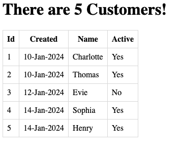

# Getting Started

Simply run from the command line using `./mvnw spring-boot:run` and then open http://localhost:8080

See [SpringBootThymeleafApplication](src/main/java/uk/co/rbrt/springbootthymeleaf/SpringBootThymeleafApplication.java) 
which is marked as a Spring MVC `@Controller` and has one `@GetMapping` to serve a Thymeleaf templated called 
`index` and is located at [src/main/resources/templates/index.html](src/main/resources/templates/index.html).

A Java `record` represents a customer with 4 fields, an id, created date, name and active flag. A list of customers is
created in the controller method and returned to the view via the Spring MVC `Model`.

The Thymeleaf template contains a basic HTML page with a table that iterates over the customers and displays the 
details. A few different examples of Thymeleaf constructs and utilities are also demonstrated.

Thymeleaf constructs used:
- `th:block` https://www.thymeleaf.org/doc/tutorials/3.1/usingthymeleaf.html#synthetic-thblock-tag
- `th:each` https://www.thymeleaf.org/doc/tutorials/3.1/usingthymeleaf.html#using-theach
- `th:text` https://www.thymeleaf.org/doc/tutorials/3.1/usingthymeleaf.html#using-texts
- `#temporals` https://www.thymeleaf.org/doc/tutorials/3.1/usingthymeleaf.html#temporals-java.time
- Conditional / Ternary https://www.thymeleaf.org/doc/tutorials/3.1/usingthymeleaf.html#conditional-expressions

Thymeleaf 3.1 User Guide: https://www.thymeleaf.org/doc/tutorials/3.1/usingthymeleaf.html